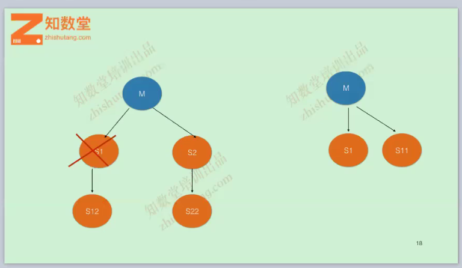

# 复制中断

- 复制中断的情况  
  MySQL复制是一个逻辑类型的复制(主键和唯一索引匹配)
  1. 从库上出现写人数据，把自增ID占用，1062错误
  2. 从库上出现少数据，delete，update操作时，找不到相应的记录，1032错误
  3. 其它

- 1062错误处理办法  
	Worker 1 failed executing transaction '9e668998-24b1-11e9-8a69-0242ac12000b:1339' at master log mysql-bin.000004, end\_log\_pos 2935; Could not execute Write\_rows event on table pay\_jinniu\_2018.system\_menu; Duplicate entry '78' for key 'PRIMARY', Error\_code: 1062; handler error HA\_ERR\_FOUND\_DUPP\_KEY; the event's master log mysql-bin.000004, end\_log\_pos 2935  
	
	**slave：**   
	set sql\_log\_bin=0;  
	delete from pay\_jinniu\_2018.system\_menu where id=78;  
	set sql\_log\_bin=1;  
	start slave sql\_thread;  


- **1032错误处理方法-update**  
	Worker 1 failed executing transaction '9e668998-24b1-11e9-8a69-0242ac12000b:1345' at master log mysql-bin.000004, end\_log\_pos 5972; Could not execute Update\_rows event on table pay\_jinniu\_2018.system\_menu; Can't find record in 'system_menu', Error\_code: 1032; handler error HA\_ERR\_KEY\_NOT\_FOUND; the event's master log mysql-bin.000004, end\_log\_pos 5972
	
	--start-position=exec\_master\_log\_pos   
	--stop-position=end\_log\_pos  
	
	mysqlbinlog -v --base64-output=decode-rows --start-position=5478  --stop-position=5972 mysql-bin.000004解析出来update语句      
	show create table pay\_jinniu\_2018.system\_menu.system\_menu查询出那些字段不能为空的  
	
	**slave：**   
	set sql_log_bin=0;  
	INSERT INTO pay\_jinniu\_2018.system\_menu  VALUES (80,'0','0','0',0,0);从库上补数据  
	set sql\_log\_bin=1;  
	start slave sql\_thread;  

- **1032错误处理方法-delete**   
	- 跳过一个事务   
	
	传统环境复制：								
	stop slave;   
	set global sql_slave_skip_counter=1;    
	start slave;    
	
	GTID环境：
	show slave status\G;得到gtid执行的位置点   
	Retrieved\_Gtid\_Set: 9e668998-24b1-11e9-8a69-0242ac12000b:1333-1346   
	stop slave;   
	set gtid\_next='9e668998-24b1-11e9-8a69-0242ac12000b:1347'; 此gtid信息为show slave status\G;得到gtid执行的位置点 下个位置点,千万注意
	begin;commit;   
	set gtid\_next='AUTOMATIC';   
	start slave;    
	

- 技术架构变更  
 
```
如果是gtid环境,直接可以change到任意一台master上面,下面介绍非gtid环境,拓展思路
1. S1,S2,S3停留在同一个位置点(说明数据也是一致的)
方法: stop slave 停掉所有从库复制
     主库上:show master status获取file和position如:mysql-bin.000004 | 837798074
     start slave io_thread; start slave  sql_thread  until MASTER_LOG_FILE = 'mysql-bin.000004', MASTER_LOG_POS =709345676 ;
     start slave io_thread;
2. 等S1,S2,S3到停留到指定的位置点在S1上执行:stop slave,再S1上show master status获取file和position如:mysql-bin.000001 | 707245577
3. S2和S3 change master to到S1上即可
	在S2和S3上面分别执行:stop slave;

start slave io_thread;   

```


 
```
M--S1--S12,S1挂了,怎么把S12 change到M身上,非gtid环境比较麻烦,具体操作如下:
1. S12上面:stop slave停掉复制,然后在S12上面最近的binlog日志里面查询到最后写人的数据
#201028  9:58:24 server id 2355811  end_log_pos 1008661354 CRC32 0x4e558f47 	Write_rows: table id 377 flags: STMT_END_F
### INSERT INTO `pressure_3`.`sbtest7`
### SET
###   @1=8
###   @2=9
###   @3='12382996440-47979932153-36554597139-30767439578-30113427798-72779825636-88408042594-00940966183-13338316269-48138834964'
###   @4='09087908838-57582595236-15735817204-15601860404-27511268092'
# at 1008661354
#201028  9:58:24 server id 2355811  end_log_pos 1008661385 CRC32 0xd89fcb44 	Xid = 4436840
COMMIT/*!*/;
发生的时间,server id, TIMESTAMP已经对应的数据,然后在M上面对应的日志中找到响应的记录,此过程可能比较麻烦,需要耐心查找
最后找到响应的记录

#201028  9:58:24 server id 2355811  end_log_pos 1014857190 CRC32 0x76b4c152     Write_rows: table id 426 flags: STMT_END_F
### INSERT INTO `pressure_3`.`sbtest7`
### SET
###   @1=8
###   @2=9
###   @3='12382996440-47979932153-36554597139-30767439578-30113427798-72779825636-88408042594-00940966183-13338316269-48138834964'
###   @4='09087908838-57582595236-15735817204-15601860404-27511268092'
# at 1014857190
#201028  9:58:24 server id 2355811  end_log_pos 1014857221 CRC32 0x57defbf4     Xid = 17769828
COMMIT/*!*/;
# at 1014857221
即:MASTER_LOG_FILE = 'mysql-bin.000003', MASTER_LOG_POS =1014857221 ;

2. change master to master_host='10.0.8.14',master_user='repl',master_password='123456',master_port=3306,MASTER_LOG_FILE = 'mysql-bin.000003', MASTER_LOG_POS =1014857221 ;
start slave;   
完成了此架构的调整

```


 
```
1. S2和S3提升和S1平级,不再是S1下面的两个从库,变成master下面的从库
方法S1停掉复制,stop slave,等待S2和S3和S1数据一致,即S1.Relay_Master_Log_File=S2. Relay_Master_Log_File,S1.Exec_Master_Log_Pos=S2. Exec_Master_Log_Pos
S1上面show master status分别同S2和S3上面Relay_Master_Log_File和Exec_Master_Log_Pos相等
2. 停掉S2和S3复制,stop slave
3. S2和S3 change到master上面,即:MASTER_LOG_FILE=S1.Relay_Master_Log_File,ASTER_LOG_POS=S1.Exec_Master_Log_Pos
change master to master_host='10.0.8.14',master_user='repl',master_password='123456',master_port=3306,MASTER_LOG_FILE = 'mysql-bin.000004', MASTER_LOG_POS =343490595 ;
```

# 复制延迟排查

- 搞明白当前数据库在干什么
	- 利用show slave status\G定位到sql——thread执行的位置
		- relay\_master\_log_file:xxxx
		- exec\_master\_log_pos:xxxx
	
	- 主节点上查看
		- mysqlbinlog -v --base64-output=decode-rows --start-position=exec\_master\_log\_pos relay\_master\_log\_file
- 查询mysql当前SQL的状态
	- show full processlist;

- 利用perf top查看MySQL的调度情况(能够进行函数级与指令级的热点查找)  
	- pidstat -t -p \`pidof mysqld\` -u 1
	- perf top -p \`pidof mysqld\` 
	
- 主库执行DDL语句
	- 在业务的低谷使用pt-osc gh-ost攻击来进行更新

- 提高从库性能 方法
	- 使用MySQL5.7使用并行复制
	- binlog group commint
	- writeset
	- 表结构设计时，一定要有主键，而且主键要短小
	- 使用PCI-E & SSD设备
	- 程序适当使用case，数据库前端使用redis，较少数据库的压力
	
- 如果其它问题都查询了,还是延迟
	- 查询一下innodb buffer pool hite命中率如果是<98说明内存不够用了,适当加大内存
		- percona prefetch sql_thread先解析relay-log提前把更新的内存加载到buffer中

# 主从一致性校验

[pt-toolkit工具](https://www.percona.com/downloads/percona-toolkit/LATEST/)   
```
测试环境：
使用hosts方式进行校验和修复

主库：10.0.8.14
从库：10.0.8.11,10.0.8.12,10.0.8.13,

创建校验用户名：
create user 'checksum'@'10.0.8.%' IDENTIFIED BY '123456'; 
GRANT ALL  on *.* to 'checksum'@'10.0.8.%'  ;  

创建库和表
CREATE database percona;
CREATE TABLE `percona`.`dsns` (
`id` int(11) NOT NULL AUTO_INCREMENT,
`parent_id` int(11) DEFAULT NULL,
`dsn` varchar(255) NOT NULL,
PRIMARY KEY (`id`)
);

插入数据：
insert into dsns(dsn) values('h=10.0.8.11,P=3306,u=checksum,p=123456');
insert into dsns(dsn) values('h=10.0.8.12,P=3306,u=checksum,p=123456');
insert into dsns(dsn) values('h=10.0.8.13,P=3306,u=checksum,p=123456');


【DSN】

指定时注意大小写敏感，“=”左右不能有空格，多个值之间用逗号分隔

1. A               charset

2. D               database

3. F                mysql_read_default_file

4. h                host

5. p                password

6. P                port

7. S                mysql_socket

8. t                 table

9.u                  user

校验：
pt-table-checksum    --host='10.0.8.14' --port=3306  --user='checksum' --password='123456' --replicate='percona.pressure_1.checksums'  --databases=pressure_1   --no-check-binlog-format   --recursion-method dsn=h=10.0.8.11,u=checksum,p='123456',P=3306,D=percona,t=dsns
pt-table-checksum    --host='10.0.8.14' --port=3306  --user='checksum' --password='123456' --replicate='percona.pressure_2.checksums'  --databases=pressure_2   --no-check-binlog-format   --recursion-method dsn=h=10.0.8.12,u=checksum,p='123456',P=3306,D=percona,t=dsns
pt-table-checksum    --host='10.0.8.14' --port=3306  --user='checksum' --password='123456' --replicate='percona.pressure_3.checksums'  --databases=pressure_3   --no-check-binlog-format   --recursion-method dsn=h=10.0.8.13,u=checksum,p='123456',P=3306,D=percona,t=dsns

打印和修复：
pt-table-sync   --replicate='percona.test1_checksums'  --sync-to-master  h=10.0.8.11,u=checksum,p=123456,P=3306  --print|execute
pt-table-sync   --replicate='percona.pay_jinniu_2018_checksums'  --sync-to-master  h=10.0.8.12,u=checksum,p=123456,P=3306  --print|execute
pt-table-sync   --replicate='percona.qipaistat_checksums'  --sync-to-master  h=10.0.8.13,u=checksum,p=123456,P=3306  --print|execute
注意事项：从库某个库上有发生相关的数据不一致，就要使用对应的从库信息去print|execute，如在172.18.0.13发生了数据不一致，则需要h=172.18.0.13,u=checksum,p=123456,P=3306 进行相关打印和修复数据

–nocheck-replication-filters 
  不检查复制过滤器，建议启用。后面可以用–databases来指定需要检查的数据库。 
–no-check-binlog-format 
  不检查复制的binlog模式，要是binlog模式是ROW，则会报错。 
–replicate-check-only 
  只显示不同步的信息，需要执行完校验，从checksum表中读取数据
–replicate= 
  把checksum的信息写入到指定表中，建议直接写到被检查的数据库当中。 
	  如创建percona.校验的库名_checksums才有此格式，方便管理
–databases= 
  指定需要被检查的数据库，多个则用逗号隔开，不指定代表所有
–tables= 
	指定需要被检查的表，多个用逗号隔开
--channel='db-3306'
	多源复制中指定的通道(如果主从是多源复制类型，必须使用)

pt-table-checksum输出的结果
TS ERRORS  DIFFS     ROWS  DIFF_ROWS  CHUNKS SKIPPED    TIME TABLE

TS：完成检查的时间
ERRORS：检查时候发生错误和警告的数量
DIFFS：0表示一致，1表示不一致(非零)；当指定--no-replicate-check时，会一直为0，当指定--replicate-check-only会显示不同的信息
ROWS：表的行数
DIFF_ROWS： 
CHUNKS：被划分到表中的块的数目
CHUNKS SKIPPED：由于错误或警告过大，则跳过块的数目
TIME：执行的时间
TABLE：被检查的表名

打印
pt-table-sync h=172.18.0.11,P=3306,u=checksum,p=123456  --replicate=percona.checksums  --channel='db-3306'  --print

--replicate=percona.checksums
	必须指定

多源复制如下：
pt-table-checksum    --host='172.18.0.11' --port=3307 --user='checksum' --password='123456'  --databases=qipaistat   --no-check-binlog-format --channel='db-3307'  --recursion-method dsn=h=172.18.0.12,u=checksum,p='123456',P=3306,D=percona,t=dsns
pt-table-sync   --channel='db-3307'   --sync-to-master  h=172.18.0.12,u=checksum,p=123456,P=3306  --print
pt-table-sync   --channel='db-3307'   --sync-to-master  h=172.18.0.12,u=checksum,p=123456,P=3306  --execute 
```

[其它相关工](具https://www.percona.com/doc/percona-toolkit/LATEST/pt-kill.html)  
[相关文档](https://www.percona.com/doc/percona-toolkit/LATEST/pt-table-checksum.html)

