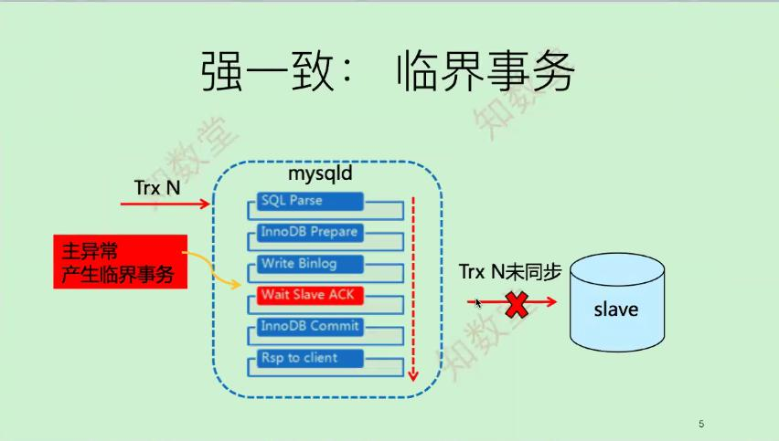
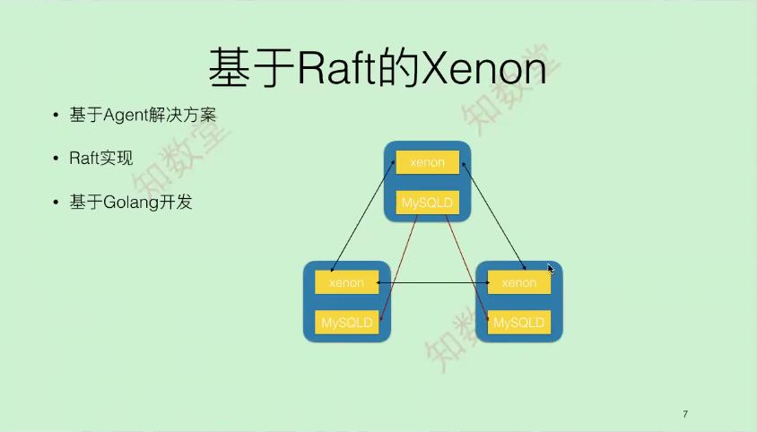
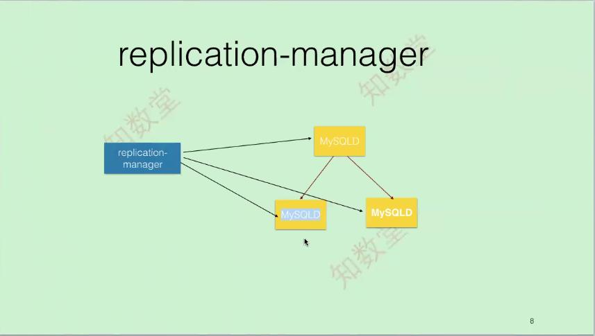
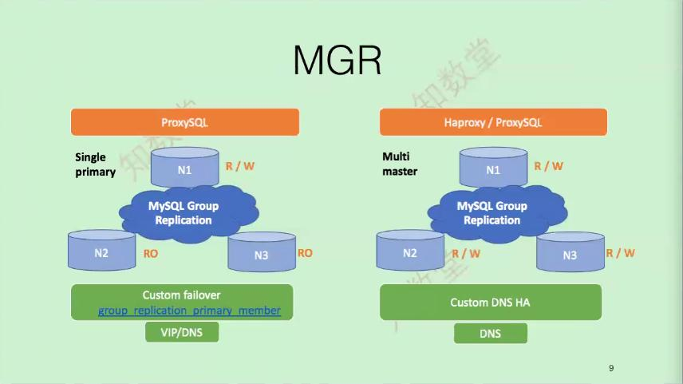
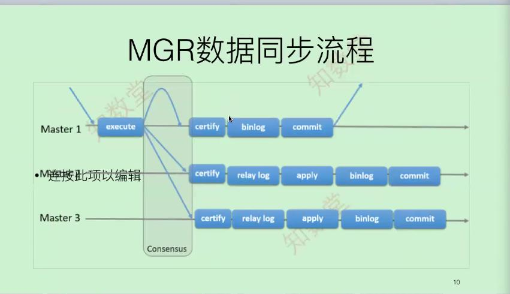
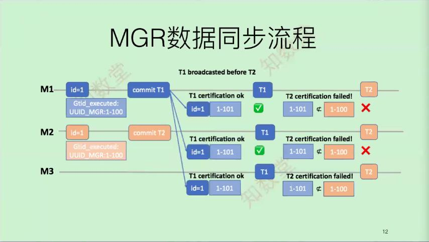
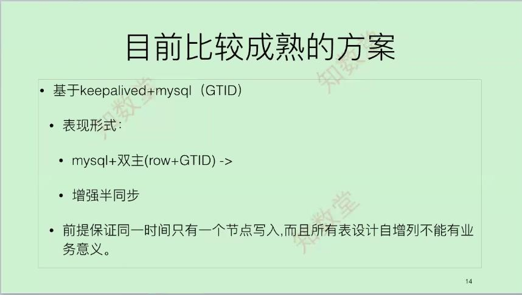
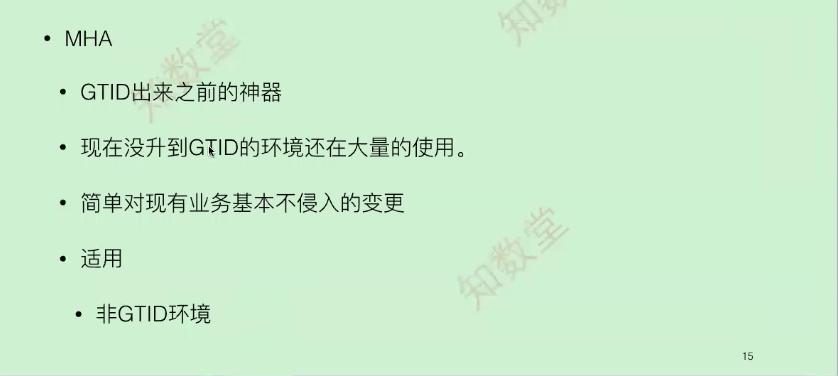
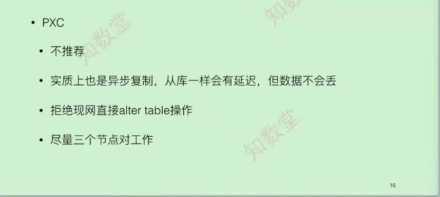
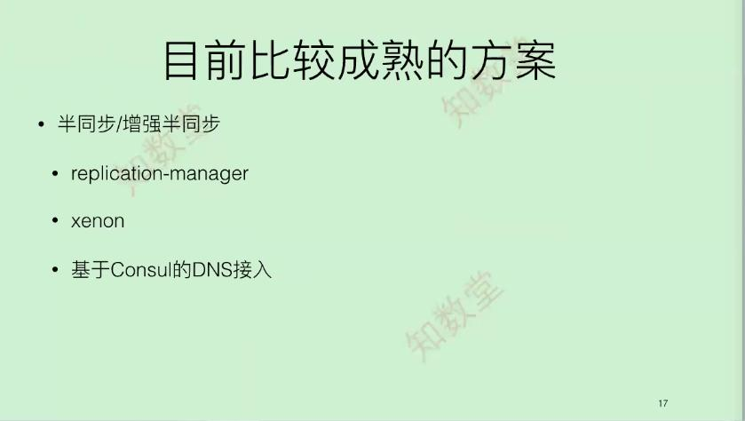

# 高可用选型

- 环境你是否hold得住
- 将来你要支撑多少台机器
- 需要根据业务选型适合公司自身需求
	- 很多游戏公司就没有高可用，数据库挂了直接游戏归档和积分奖励
	- 金融环境必须高可用
	- 其它有些对高可以用不太重视的
	
## 高可用类型

### MHA

- 直观感受
	- Perl程序，基于SSH认证切换，对于SSH依赖较重
	- 如果未来更安全的复制，需要考虑加入binlog server
- 优点
	- 非GTID及非半同步环境，使用可以补偿数据
- 缺点
	- GTID和半同步环境，MHA作用不大，在半同步和增强半同步中不要使用MHA(临界事务无法处理，会自动补偿到从库上面；异步复制中无法区分临界事务，客户端不会等待ack相应)
- 很多传统类的公司，没有使用半同步和GTID中的公司使用，玩得最溜是小米(通过监控来调用masterha_manager来进行自动切换，不再启用manager了)

#### 强一致性：临界事务
问题：Master写binlog成功，单binlog同步时，数据库crash，master恢复时会重做这个事务
   
MGR处理方法：获取本地gtid信息，再看一下远程的gtid，如果发现本地多的就把本地truncate掉，保持本地和远程gtid信息是一致的   
TDSQL处理方法：在业务层引入回滚机制，引入交易网关，所有的sql操作都有一个TrXID唯一编号，当主库挂掉没有收到从库的ack相应，就会进行重试，如果还是没有成功就回滚这一次操作   

半同步/增强半同步结构中：使用keeplived，replication-manager，xeron，orch专门针对半同步开发，用于主库进行切换  


### 青云xenon高可用架构
 
```
1. Raft协议中只能有一个lead
read_only=0
super_read_only=0  
sync_binlog=1
innodb_flush_log_at_trx_commit=1
如果是follow节点，将其自动设置
read_only=1
super_read_only=1
sync_binlog=0
innodb_flush_log_at_trx_commit=2   
2. Raft通讯在每个写事件都会编一个index，所有写都是串行的，这个编号就是用gtid信息作为它的index信息，发现从节点index和我主节点不一致就下线，保证数据的强一致性   
3. 目前青云rds数据库架构中使用

```

### Replication-Manager
   
此架构中需要使用GTID和增强半同步(异步复制官方也只是保证99.9%数据一致性，如果光靠数据库保证数据安全性和一致性是比较困难的，数据库各种数据不一致性，和死锁等情况，需要在业务层和代码层进行控制两者结合才是上策)  
Replication-Manager：监控的数据库实例为50-60个，使用公司目前美的

### MGR
    
多节点写入在MGR和PXC都会出现更新丢失   
c1,c2 -->t1:A,B都读到old值n1,n2  old.v=100;   
c1,t2 -->t2:A基于old值进行更新update set old.v=20;   
c2,t3 -->t3:B基于old值进行更新update set old.v=200;   
最终的数据变成old.v=200，谁更新到最后最终的值就是谁的，之前的都被覆盖了，正确应该是t3时间B节点基于20来进行更新，而不是基于100更新，所以这就是更新丢失   
单主可以使用InnoDB锁进行控制   

   
不管在PXC还是MGR都是异步的，不会是同步进行
MGR所有的操作还是基于binlog复制，这个binlog复制不再是通过IO\_thread来传输，而是通过一个广播机制在传输，传输到其它节点上后，其它节点把更新操作放到本地的relay中，然后基于write set或者多线程并发的机制进行应用，然后进行commit过程
PXC是基于块复制apply\_cb会在其它节点上有个应用块过程，这个应用也是有延迟的

  
此图介绍多节点同时写入数据同步流程,防止更新错乱，不能避免更新丢失    
MGR中gtid的分配并不是连续的，每个节点默认分配一百万以此循环
M1节点在写入数据时候，获取集群gtid信息如果发现比自己的gitd小，进行更新操作，gtid信息相应增加，其它节点应用更新     
此时M2节点也在写入数据，判断集群的gitd信息比自己本地的大，说明有更新操作，或者正在更新，需要等待比它之前的事务应用完后才能更新操作  

**MGR总共经历7个流程如下所示**

- write transaction context to group replication cache
- write gitd log event to group replication cache
- copy group replication cache to buffer
- copy binlog cache content to buffer
- flow control step
- broadcast transaction message
- waiting for certifier is notify

生成事务的内容--生成事务ID--拷贝事务内容到buffer--是否发起流控--广播消息通知--等待验证通过后继续进行


## 高可用方案推荐小规模


  
为啥自增列不能有业务意义(如果做成业务uid，订单id，账单id)：  
- 数据库无法拆分(可以做表关联)
- 数据库切换(主从自增列没有对齐会导致数据不一致)
- 数据如果有缓存，表truncate了，那么自增列在缓存中也会不一致
- 使用消息队列使用index使用自增列，数据将全部废了   
考虑数据拆分数据可维护，一定不能使用自增列做有业务意义
此架构规模在16台左右，3-5套数据库，如果对数据要求比较严格可以使用增强半同步(需要考虑临界事务，当前节点发生故障，需要重建)   


   


   


## 高可用方案推荐大规模
   

- 20以内
- 50-100
- 200以上(监控和网络复杂度都比较高了，到了此规模，现有的工具基本不能满足需求，需要单独开发或者定制开发)

## 最后总结

规模小的且非GTID环境中可以使用keeplived和mha
对数据要求不是很高可以选择异步复制，交易环境对数据要求比较高可以使用增强半同步(row+gtid),交易环境如果有更高的要求可以使用MGR选择单点写入
