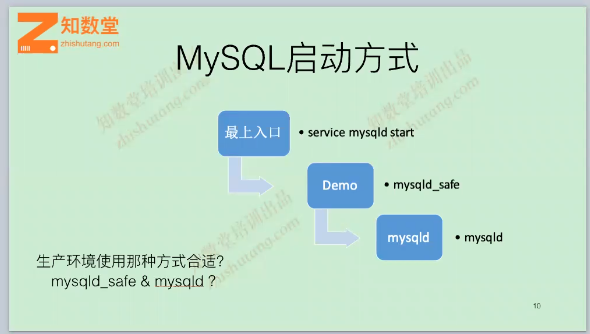

# 多实例安装部署

## 为什么要使用多实例
- 物理机强劲，单个项目无法把资源用完
- 限制单个实例数据库的大小
- 资源隔离，减少相互影响，
- 分担连接数
	- MySQL随着连接数上升，性能会出现严重下降
- 充分的利用资源
	- 不同业务错高峰混跑
- 单实例物理文件过大，备份恢复周期超过预期

### 资源对其：  
Small型：4G+2C+200G  
modum型：16G+4C+400-500G  
Large型：32G+16C+1T  
单台物理机推荐的实例数为8个，最多16个    
通过资源对其可以很好的对资源池的统计

## MySQL多实例启动和关闭的方法

```
最好的启动和配置的方法，给每个实例单独的配置文件和datadir

mysqld --defaults-file=/data/mysql/mysql3306/my.cnf &
mysqld --defaults-file=/data/mysql/mysql3307/my.cnf &
mysqld --defaults-file=/data/mysql/mysql3308/my.cnf &

mysqladmin -S /tmp/mysql3306.sock -pxxx shutdown
生产环境中指定配置文件，可以做到可控，防止加载其它配置参数导致数据库异常
注意：还有类似于使用mysqld_safe和mysqld_multi这种方法都没有使用上述方法方便和可维护

```

### MySQL默认加载配置文件顺序

  

	mysqld --defaults-file=/data/mysql/mysql3306/my.cnf --print-defaults 打印出加载的参数
	
	
### mysqld启动过程

 
	
	strace分析mysqld启动过程  
	strace -Ttt /usr/local/mysql/bin/mysqld  2>&1|tee an.log 运行不动的时候ctrl+c退出
	

### 多实例配置文件所注意的事项

```
port                                =3306
server_id                           =113306 
basedir                             =/usr/local/mysql/ 
datadir                             =/data/mysql/mysql3306/data
socket                              =/tmp/mysql3306.sock
log_bin                             =/data/mysql/mysql3306/logs/mysql-bin

生产环境中每组端口号保持唯一，每组成员内端口号是一致的，防止实例数较多发生连接错误
server_id建议使用IP的最以后一位加上端口号
```

## 篇幅总结

- 数据库安装部署是自动化安装的基础
- 方式比较多，选择自己擅长的方式便于管理
- 生产环境不建议使用多版本，对运维管理麻烦，建议只维护一个版本，可以存在两个版本过渡(sql_mode=''升级可以兼容所有的语法)
