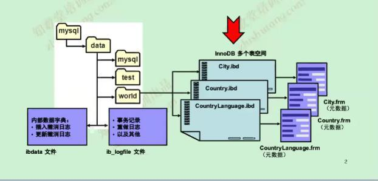

# MySQL日志

## MySQL5.7目录结构

basedir=/usr/local/mysql   
datadir=/data/mysql/mysql3306/data



- MySQL5.7每个库单独的一个目录
- .frm为表结构的定义文件
- .ibd为表空间文件(数据和索引在此文件中)
- error.log此日志文件很重要，需要实时监控其输出  
  方法很多(简单的方式每5分钟拷贝走，使用diff比较)

## 日志文件  

MySQL相关的日志非常长，列举出工作中重要的和常用的日志文件  
- MySQL-server层
	- error.log(文本)
	- general.log(文本)
	- slow.log(文本)
	- binlog(二进制)：mysql-bin.000001
	- relog(二进制)
- InnoDB层
	- redo
	- undo  
		- innochecksum -S可以解析ibdata文件
	


### 二进制日志
- 相关参数  
```
log_bin = mysql-bin
binlog_format = row
expire_logs_days = 7 MySQL5.x系列默认没有过期，8.0以秒为单位默认30天

注意：statement：DDL，DML-->语句是以原始的格式存在(在rr事务隔离级别中)，会导致数据的不一致性，所以在生产环境中，为了数据一致性所以使用row格式，其它格式都不要使用
为什么使用statement格式会导致数据不一致：
1. 使用uuid，sysdata()等函数的时候导致数据更新不一致
2. update tab1 set c1=xxx limit 1主从排序不一致性的时候导致更新数据不一致

```
- binlog日志相关命令   
```
show binary logs;列出当前日志文件及大小  
mysqlbinlog -v  --base64-output=decode-rows  /data/mysql/mysql3306/logs/mysql-bin.000001` 解析日志文件内容
show master status;显示MySQL的日志及状态(需要super，relication，client权限)[slave-status](https://www.cnblogs.com/paul8339/p/7615310.html)   
show binlog events in 'mysql-bin.000001';以事件的格式显示  
purge binary logs to 'mysql-bin.000001';清理binlog日志  
binlog日志注意事项
log-bin日志在线上主从都需要开启，保存的天数可以根据磁盘的容量进行评估
DCL，DDL语句在binlog中只是存储statement的格式
DML语句在binlog_format = row中，update更新不仅有新的记录而且还有旧的记录  如果发生误操作，还可以进行闪回。  
```


#### 理解binlog

- 根据日志定义的格式不一样可以分成：statement(SBR)，Row(RBR)或者MTXED格式
- 记录最新单位是一个Event，日志前4个字节是一个magic number(0xbin)，接下来19个字节记录Format desc event：FDE包(日志描述)
```
FDE包信息如下：
# at 4 postion偏移量表示后面的内容从第4个字节开始
#190426 18:38:11 server id 3306551  end_log_pos 123 CRC32 0x944e582f    Start: binlog v 4, server v 5.7.25-log created 190426 18:38:11
```

```
Log Rotate event:
190424 23:04:35 server id 3306551  end_log_pos 201 CRC32 0x9833b72e    Rotate to mysql-bin.000003  pos: 4
```
[日志事务类型](https://dev.mysql.com/doc/internals/en/event-classes-and-types.html)
- 一个事务由多个event组成如：
	- BEGIN
	- Table_map
	- Write_rows
	- Xid
	- COMMIT
- binlog包含：binary log和binary log index文件

#### 复制中记录binlog格式

MySQL中使用row格式进行复制，原因如下：
- statement格式复制的优缺点
	- 优点：
		- 基于语句级别的复制binlog_format=statement
		- binlog文件较小
		- binlog方便阅读，方便故障修复
	- 缺点：
		- 存在安全隐患，可能导致主从不一致的
		- 对一些系统函数不能准确复制或者不能复制，MySQL5.1抛弃了statement格式
			- load_file()
			- uuid()
			- user()
			- sysdate() 
			
- row格式复制的优缺点：
	- 优点：
		- 相比statement格式更加安全binlog_format=row
		- 在某些情况下复制速度更快(sql复杂，表有主键)、
		- 系统的特殊函数也能够复制
		- 更少的锁
	- 缺点：
		- binary log比较大
		- 单语句更新(删除)表的行数量过多，会形成大量的binlog
		- 无法从bin_log看见用户执行的sql(binlog_rows_query_log_events记录用户的query)

- mixed格式：
	- 此种格式属于一个过渡的格式
	- MySQL很多版本的新特性都是针对row+gtid，所以不要使用这种格式，没有太多的价值
	
#### row格式binlog执行流程
  
```
master把更新内容写到binlog里面-->  
dump_thread唤醒IO_thread告诉我有更新了-->  
IO_thread把日志拉取到本地放到relay(供SQL_thread进行重放)日志中-->  
SQl_thread读取relay日志会查看语句有没有主键-->用主键匹配记录更新数据库  
没有主键查是否有二级索引-->利用第一个最长(字符类型的字节数)的索引匹配(内部隐藏  的rowid)
5.6每次全表扫描，5.7做了优化(第一次做全表扫描生成hash索引，以后走hash索引进行更新，重启丢失；所以每个必须需要主键，此种情况这个从库基本不可用，各种延迟(解决办法：从库停掉，在从库上添加索引，方可解决)  


set sql_log_bin=1;关闭二进制日志功能，从库上新增相应的索引；然后在合适的时候在主库上新增相应的索引，最后启动二进制日志功能
# GTID用于解决什么问题

GTID：为每个写的动作做一个唯一的编号  
- 主机和从库上分别产生了多少个写事务 
- 这个事务是谁产生的
```

### 错误日志error.log

- 相关参数  
  `log-error = error.log`
- error.log此日志文件很重要，需要实时监控其输出,方法很多(简单的方式每5分钟拷贝走，使用diff比较)   


### 慢日志slow.log
- 相关参数：  
  `slow_query_log = on |set global slow_query_log=1或者set persist slow_query_log=1`  
  `long_query_time = 1`  
  `slow_query_log_file = slow.log`  
- sys.statement_analysis  
   此表有详细SQL数据信息(多少SQL语句请求，高峰期时段SQL，当前慢查询的大小，数量等)，具体分析请读MySQL监控分析章节
- set persist持久化，属于8.0修改变量的新特性，存放于文件mysql-auto.cnf，下次重启数据库后会加载

### 审计日志general.log
目前不管收费还是开源的审计插件，对MySQL性能直接有很大的杀伤作用  
**MySQL dba**专家强烈不推荐使用MySQL企业版，因为目前没有任何觉得MySQL企业版优于社区版本,也不推荐购买官方的审计组件
如果一定要购买企业版，建议值得购买的插件如(enterprise backup、thread-pool)  
- 在早期之前很多金融和支付类的公司一般使用如下办法解决  
   相关参数  
  `general_log = on`   
  `general_log_file = general.log`
   所有的操作记录全部放到general.log里面，此方法在早期如5.5,5.6版本中这样来使用
- 5.7中解决方案
  query_rewrite_plugin做二次开发，拦截MySQL语句，使其存入日志分析平台中(如:elk)
  
### 核心命令
- show databases;
- show tables;
- show processlist;
- show create table tb_name;
- show index from tb_name;
- show open tables;
- show table status;
- show columns from tb_name;
- show character set;
- show collation;  
注意：show语句支持like和where使用

## MySQL裁剪
适用场景：物联网做盒子的企业都需要用到MySQL裁剪
- strip mysqld/mysql一条核心的命令即可，就这么点东西


