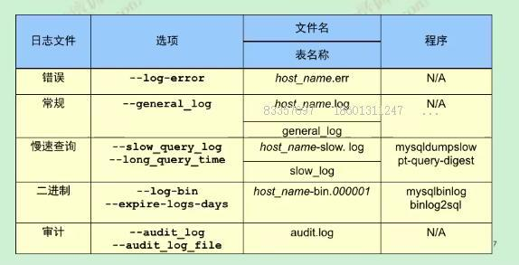

# MySQL5.7目录结构

- MySQL5.7每个库单独的一个目录
- .frm为表结构的定义文件
- .ibd为表空间文件(数据和索引在此文件中)
- error.log此日志文件很重要，需要实时监控其输出  
  方法很多(简单的方式每5分钟拷贝走，使用diff比较)

## 日志文件  

### 错误日志

- 相关参数  
  `log-error = error.log`
- error.log此日志文件很重要，需要实时监控其输出,方法很多(简单的方式每5分钟拷贝走，使用diff比较)

### 慢查询日志
- 相关参数：  
  `slow_query_log = on`  
  `long_query_time = 1`  
  `slow_query_log_file = slow.log`  
- sys.statement_analysis  
   此表有详细SQL数据信息(多少SQL语句请求，高峰期时段SQL，当前慢查询的大小，数量等)，具体分析请读MySQL监控分析章节
   
### 二进制日志
- 相关参数  
  `log_bin = mysql-bin`  
  `binlog_format = row`
  `expire_logs_days = 7` MySQL5.x系列默认没有过期，8.0以秒为单位默认30天
- binlog日志相关命令   
  `show binary logs;` 列出当前日志文件及大小  
  `mysqlbinlog -v  --base64-output=decode-rows  /data/mysql/mysql3306/logs/mysql-bin.000001` 解析日志文件内容
  `show master status;` 显示MySQL的日志及状态(需要super，relication，client权限)  
  `show binlog events in mysql-bin.000001;`以事件的格式显示  
  `purge binary logs to 'mysql-bin.000001';`清理binlog日志  
- binlog日志注意事项
	- log-bin日志在线上主从都需要开启，保存的天数可以根据磁盘的容量进行评估
	- DCL，DDL语句在binlog中只是存储statement的格式
	- DML语句在`binlog_format = row`中，不仅有新的记录而且还有旧的记录  
	  如果发生误操作，还可以进行闪回。  

### 审计日志
目前不管收费还是开源的审计插件，对MySQL性能直接有很大的杀伤作用  
**MySQL dba**专家强烈不推荐使用MySQL企业版，因为目前没有任何觉得MySQL企业版优于社区版本,也不推荐购买官方的审计组件
如果一定要购买企业版，建议值得购买的插件如(enterprise backup、thread-pool)  
- 在早期之前很多金融和支付类的公司一般使用如下办法解决  
   相关参数  
  `general_log = on`   
  `general_log_file = general.log`
   所有的操作记录全部放到general.log里面，此方法在早期如5.5,5.6版本中这样来使用
- 5.7中解决方案
  query_rewrite_plugin做二次开发，拦截MySQL语句，使其存入日志分析平台中(如:elk)
  
### 核心命令
- show databases;
- show tables;
- show processlist;
- show create table tb_name;
- show index from tb_name;
- show open tables;
- show table status;
- show columns from tb_name;
- show character set;
- show collation;  
注意：show语句支持like和where使用

## MySQL裁剪
适用场景：物联网做盒子的企业都需要用到MySQL裁剪
- strip mysqld/mysql一条核心的命令即可，就这么点东西