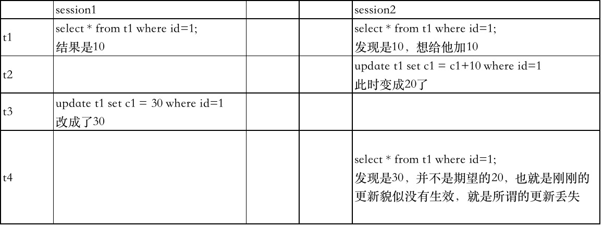
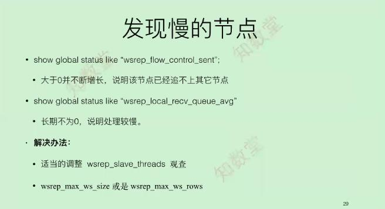
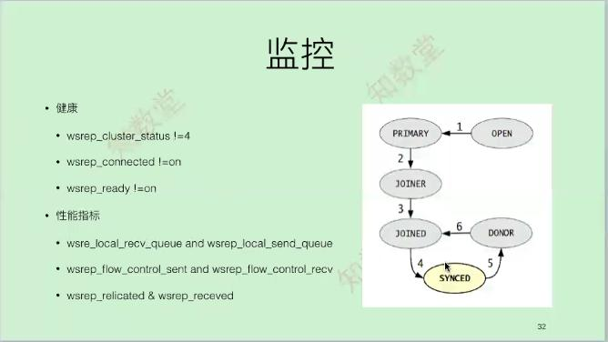
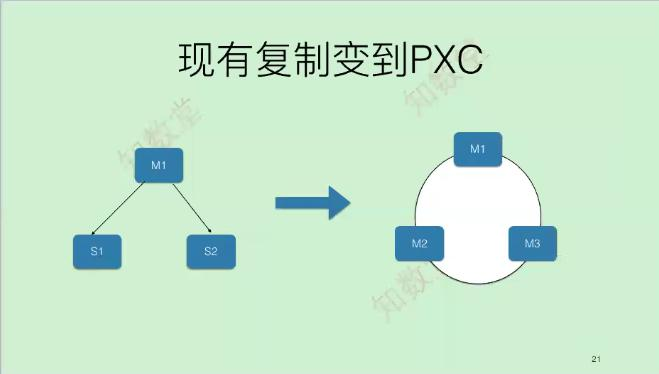

# PXC介绍
[原理参考资料](https://cloud.tencent.com/developer/article/1026107)  
- 全称Percona Xtradb Cluster


  

在多主或双写结构当中，一定需要考虑update更新这么处理，update还是需要单点更新，insert和delete没有关系   

  
什么是更新丢失：  
以一个工单的例子，你和A看到一个工单都是未完成的状态，此时你点击了驳回，你应该看到的是驳回状态，A点了执行，此时你再看工单状态是已执行的状态了

### 搭建PXC

[软件下载](https://www.percona.com/downloads/Percona-XtraDB-Cluster-LATEST/)

```
#pxc
innodb_locks_unsafe_for_binlog=1
innodb_autoinc_lock_mode=2

loose-wsrep_cluster_name=pxc_wubx 
loose-wsrep_cluster_address=gcomm://172.17.0.2,172.17.0.4
loose-wsrep_node_address=172.17.0.3
loose-wsrep_provider=/usr/local/mysql/lib/libgalera_smm.so

loose-wsrep_sst_method=xtrabackup-v2
loose-wsrep_sst_method=rsync
loose-wsrep_sst_auth=sst:123456

--生产环境中，下面两个参数需要关闭
loose-wsrep_debug=on
loose-wsrep_provider_options="debug=on"
其它节点陆续拉起来启动上面两个参数
特别提示：如果第二个节点拉不起来，提供第一个节点error.log，innobackup.log和第二个节点的error.log


安装依赖
yum install  -y  perl-IO-Socket-SSL perl-DBD-MySQL perl-Time-HiRes socat nc lsof rsync

正常初始化后第一个节点启动，其它节点无需加--wsrep-new-cluster
mysqld --defaults-file=/data/mysql/mysql3306/my.cnf --wsrep-new-cluster  &

create user 'sst'@'localhost' identified by '123456';
grant reload,lock tables,replication client,process on *.* to 'sst'@'localhost';

检查是主节点是否正常
show global status like '%wsrep%';状态如下表示正常
wsrep_cluster_status            Primary
wsrep_local_state               4        
wsrep_local_state_comment       Synced   
wsrep_connected                 ON 
wsrep_cluster_size              3 

```

###其它
在PXC中xid是连续自增的，把binlog中的xid改成自己的全局的事务id(类似于gtid)，扩展一下在MySQL里面只有dml语句才有xid记录，但是在PXC中内部默认也会有记录xid，MySQL虽然支持oneline ddl操作，在PXC环境中禁止使用ddl操作，

- 原理   
当client端执行dml操作时，将操作发给server，server的native进程处理请求，client端执行commit，server将复制数据写WriteSet的集合发给group，group集群会协商出一个唯一标识的XID(类似于GTID)
，其它server接收到并通过验证(合并数据)后，执行appyl_cb动作和commit_cb动作，若验证没通过，则会discard处理;当前server节点验证通
过后，执行commit_cb，并返回，若没通过，执行rollback_cb。

如果是ddl语句，所有成员都要调用成功，这个时候集群什么都干不了
PXC目前有点老不建议在生产环境中使用，强烈建议使用MGR，目前财务通和美团都是大规模的使用

###重要的概念
- gcache.size
- gcaceh.mem_size
- gcache.page_size
- gcache.dat
特别提示：
gcache.size是galera一个重要的功能，生产环境1-4G(以小时为单位，每个小时产生多大的binlog日志，加入节点前离线最长时间就为一个小时)，用于缓存当前write-set，供其它节点加入进来传输IST而不是SST，节点关闭后gcache.size中有个取值范围，
wsrep_provider_options="gcache.size=4G";初始化的时候需要改成你需要的值，否则无法修改

strings gcache.size|grep seqno查看文件内容  
seqno_min: 69
seqno_max: 2069


###新节点加入
数据库维护的时候节点下线不要超过2个小时，超过这个时间建议先把这个节点做成slave，待数据同步完后进行重新加入；或者备份文件超过2个小时的也是如此   
- 具体方法如下
```
1. 主从数据同步完后
stop slave;
show slave status\G 得到如下信息：
Executed_Gtid_Set:c13a953e-ae8e-ee16-7c89-fc9c133d40f9:1-5848
Relay_Master_Log_File: mysql-bin.000008
Exec_Master_Log_Pos:1855232
 
2. 主库上解析binlog日志找打xid的值
mysqlbinlog -v --base64-output=decode-rows  mysql-bin.000008 
找到1855232位置点所对应的xid的值(解析出来1855232对应的xid=5851，所以上一个是5850)，因为pxc中xid是连续自增的

3. 创建grastate.dat文件
grastate.dat中内容可以拷贝其它节点的信息

# GALERA saved state
version: 2.1
uuid:    3ec56ac1-5171-11e9-8376-0363ecc2bf06
seqno:   5850#这个值就是我们刚才找到的xid的值，记得修改权限mysql
safe_to_bootstrap: 0

4. 修改my.cnf添加pxc相关参数
5. 启动mysql，如正确操作，即可启动，如果新节点加入不了，请查询相关日志进行解决

```

###PXC限制

- 只支持InnoDB引擎，没有表级锁定，DDL语句会把整个集群全部锁住，kill不掉，使用pt-online-schema-change操作  
- 不支持InnoDB表空间传输，不支持XA事务
- Query log不能使用table，只能用log_output=file
- binlog_rows_query_log_events不支持
- 都停机了重新启动，会出现SST全量传输，采取手工的方式进行，分节点加入解决
- 不能使用自带的备份进行还原，会拖死整个集群，sst使用slave -> PXC
- 使用乐观锁，显示事务commit可能会失败


### 监控和性能


  


  


### 需要动手实现的结构
 