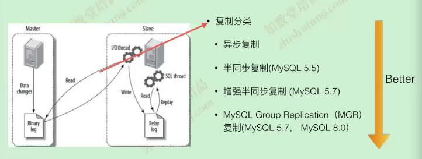
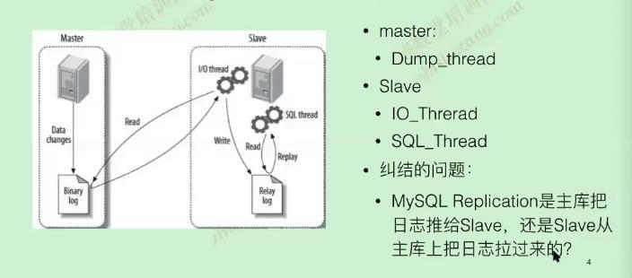
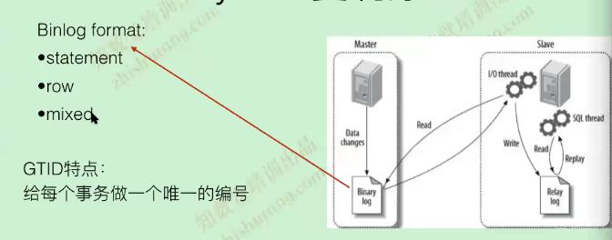

# 主从搭建

-----

### 基于：Row+Gtid的复制

- 参数设置
```
binlog_format                       =row
log_bin                             =/data/mysql/mysql3306/logs/mysql-bin                       
	
gtid_mode                           =on 
enforce_gtid_consistency            =on 

server_id                           =123306建议IP最后一位+端口号
```
- 账户和权限设置
```
create user 'repl'@'172.18.0.0/255.255.255.0' identified by 'xxx';
grant replication slave on *.* to 'repl'@'172.18.0.0/255.255.255.0'; 
```
- 执行操作
	- 备份数据库  
	```
	mysqldump -hxxx  -uxxx -pxxx -A --single-transaction --master-data=2|gzip > all.sql.gz
	```

	- 恢复到从库上  
	`mysql -hxxx -uxxx -pxxx < all.sql`
	
	
	如果从库的GTID_PURGED信息需要和主从保持一致(针对从其它库备份过来的，出现额外的gtid信息多余的情况)，以下处理
	- show slave status\G;查询Executed_Gtid_Set信息，复制主库上面不包含gtid的信息
	- stop slave;
	- reset master(8.0无需此操作了)
	- set global gtid_purged=''填入复制主库上面不包含gtid的信息
	- start slave 
	
	GTID_EXECUTED:它是一组包含已经记录在二进制日志文件中的事务集合(表示执行了多少个事务)    
	GTID_PURGED:它是一组包含已经从二进制日志删除掉的事务集合(这些事务已经在数据库文件中，但是binlog中已经没有了)  
	
```
change master to 
master_host='172.18.0.11',
master_port=3306,
master_user='repl',
master_password='xxxxxx',
master_auto_position=1;

```
### 复制的种类



### 复制的线程

- io_thread  
	- 异步复制
	- 半同步复制
	- 增强半同步复制
- sql_thread  
	- 5.6基于database级别的并行
	- 5.7基于binlog group commit(基于事务级别的并行)
		- 原理：与组提交结合，一个组提交的事务都是可以并行回放，因为这些事务都已进入到事务的prepare阶段，则说明事务之间没有任何冲突（否则就不可能提交）
	- 8.0基于writeset(行级别)  
	[更多关于复制详情](http://www.mamicode.com/info-detail-2449623.html)   
  

### 日志分类




### 双主
```
auto_increment_offset = 1
auto_increment_increment = 2         #奇数ID                                   
#masterB自增加ID
auto_increment_offset = 2
auto_increment_increment = 2         #偶数ID         

                          
```