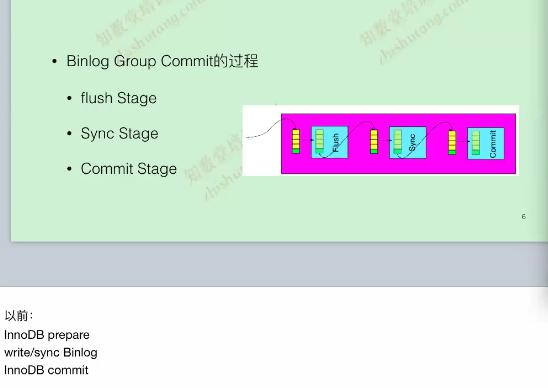

# Master配置优化

- binlog\_format                       =row
- gtid\_mode                           =on  
- enforc\_gtid\_consistency            =on  
- binlog\_group\_commit\_sync\_delay      =100   
- binlog\_group\_commit\_sync\_no\_delay\_count = 10
	- slave\_parallel\_type			  =logical_clock
	- slave\_parallel\_workers		  =8
- binlog\_order\_commits				  =on 建议还是开启  

[replication主要参数解释](https://www.cnblogs.com/zping/p/9171528.html)

   
- InnoDB, Prepare
    SQL已经成功执行并生成了相应的redo和undo内存日志； 
- Binlog, Flush Stage
    所有已经注册线程都将写入binlog缓存； 
- Binlog, Sync Stage
    binlog缓存将sync到磁盘，sync_binlog=1时该队列中所有事务的binlog将永久写入磁盘；
- InnoDB, Commit stage
    leader根据顺序调用存储引擎提交事务；
    
binglog group commit是5.7引入，为了提高从库的应用速度，在主库上尽量提高并行；8.0设计是针对从库，即使主库在串行提交事务，只要不相互冲突，在slave上也可以并行回放：WriteSet
- binlog\_transaction\_dependency\_tracking=commit_order|writeset|writeset_session
- transaction\_write\_set\_extraction (hash方法)
- binlog\_transaction\_dependency\_history\_size (hash大小)

[WriteSet1](https://www.cnblogs.com/danhuangpai/p/10254935.html)  
[WriteSet2](https://zhuanlan.zhihu.com/p/37129637)  

# IO_thread

- slave\_net\_timeout=20

# SQL_thread

- log\_slave\_updates
- slave\_parallel\_type=LOGICAL_CLOCK
- slave\_parallet\_workers=4|8
- 比较鸡肋的功能
	- slave\_checkpoint\_group=512   
	- slave\_checkpoint\_period=300
	- slave\_preserve\_commit\_order=on
	- slave\_rows_search\_algorithms=TABLE_SCAN,INDEX_SCAN  
	linlog更新首先找主机，没有走普通索引，还没有全表扫描；所以MySQL表必须要有主键
	
	
# 复制过虑功能

复制过虑功能实际生产环境中应用极少，建议不要使用，容易导致主从数据不一致；如果实在要用，可以在从库上进行配置  

CHANGE REPLICATION FILTER  
REPLICATE\_DO\_DB = (test1)只同步test1库    
REPLICATE\_IGNORE\_DB = (test1,test2)忽略test和test2库的同步    
REPLICATE\_IGNORE\_TABLE = (test1.tab1)忽略test1库中的tab1表    
REPLICATE\_WILD\_DO\_TABLE = (test1.%)正则表达式只同步test1库所有表    
REPLICATE\_WILD\_IGNORE\_TABLE = (test1.%)正则表达式忽略test1库所有表    

# carsh-safe replication 

relay\_log\_info\_repository   = table  
relay\_log_recovery			   = 1  
sync\_relay\_log			   = 1  
sync\_relay\_log\_info		   = 1  
sync\_master\_info			   = 1  

# 延迟复制

- stop slave sql_thread;
- change master to \  
  master\_delay=3600;延迟一个小时  
  master_delay=0;禁用延迟复制
- start slave sql_thread;

# 多源复制
master\_info\_repository   = table 
relay\_log\_info\_repository   = table  
relay\_log_recovery			   = 1  
sync\_relay\_log			   = 1  
sync\_relay\_log\_info		   = 1  
sync\_master\_info			   = 1 

binlog\_format                       =row
gtid\_mode                           =on  
enforc\_gtid\_consistency            =on 
以上参数为前提条件
stop slave;
show master status;查询旧的old_gtid
reset master;
导入数据库
show master status;查询新的new_gtid
set global gitd_purged='old_gtid,new_gtid'每次增加一个源都要进行相应的gtid_purged

change master to \  
master_host='172.18.0.11',\
master_user='repl',\
master_port=3307,\
master_password='123456',\
master_auto_position=1 for channel 'db-3307';指定对应的通道

start slave;
show slave status for channel 'db-3307'\G;

# 增强半同步

INSTALL PLUGIN rpl\_semi\_sync\_master SONAME 'semisync\_master.so';  
INSTALL PLUGIN rpl\_semi\_sync\_slave  SONAME  'semisync\_slave.so';  

set global rpl\_semi\_sync\_master\_enabled=1;  
set global rpl\_semi\_sync\_master\_timeout=N(毫秒);  
set global rpl\_semi\_sync\_master\_wait\_for\_slave\_count=1;  
set global rpl\_semi\_sync\_slave\_enabled=1;  

stop slave io_thread;  
start slave io_thread;  
增强半同步需要注意的以下几个问题：
- 如果master上全部从库挂掉了，可以临时禁用半同步，让master对外提供服务
- 如果拿一个备份新建一个从库，确认IO_thread追上主库后再开设半同步
- 金融环境是不允许退化成异步

# 其它优化

- 主库上  
set global rpl\_semi\_sync\_master\_enabled=1;   
set global rpl\_semi\_sync\_slave\_enabled=1;  
set global read\_only=0;  
set global super\_read\_only=0;  
set global sync\_binlog=1;  
set global innodb\_flush\_log\_tx\_commit=1;  

- 从库上  
set global rpl\_semi\_sync\_master\_enabled=1;   
set global rpl\_semi\_sync\_slave\_enabled=1;  
set global read\_only=1;  
set global super\_read\_only=1;  
set global sync\_binlog=0;  
set global innodb\_flush\_log\_tx\_commit=2; 

<!--------------
[https://www.feilvbin.ren/20181606/]   