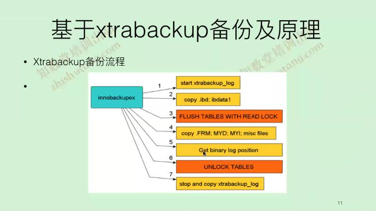

# 常用备份工具

[名词解释](https://blog.csdn.net/joe_007/article/details/7014381)  
[参考资料](https://www.jianshu.com/p/4e3edbedb9a8)

## mysqldump工具
mysqldump --single-transaction --master-data=2   
一定需要加上以上2个参数，但是不支持非事务表，如果不加入此参数备份是数据不一致性的备份或者是无效的备份
```
mysqldump --single-transaction --master-data=2 
-A：备份所有库
-B：备份单个库(生成create database语句)，-B database_name1 database_name2 ..
-d：只导出表结构
-t：只导出数据
--where="1=1 limit 10000"：导出前10000行数据
-x：备份非事务表，锁定所有的表进行备份，对业务有影响，但是为了数据一致性必须这样做
mysqldump最佳实践：
mysqldump --single-transaction --master-data=2 -A |gzip > $dbname-$port-`date +%Y%m%d`.sql.gz
gzip：也可以换成bzip2或xz更高效的压缩比工具

以上备份作为主从关系数据一致性得到保障，如果不是这样的关系备份需要加上以下参数
--set-gtid-purged=off

```

### mysqldump工具执行原理
流程如下：   
```
1. flush tables;  medata lock如果拿不到说明有长事务或者DDL
2. flush table with read lock; 关闭所有的表，并给所有数据库的表加上一个global read lock  
							   这个对于backup操作来说很有用，加锁之后，可以防止应用修改数据库，这个是全局级别的锁，而非表锁
3. set session transaction isolation level repeatable read;
4. start transaction;事务开始;
5. get gtid;
6. show master status;
7. unlock tables;

8. savepoint sp(事务内的断点);
9. show tables;
	show create table tb_name1;
	select * from tb_name1;
10. rollback to savepoin sp;每次此操作是为了备份过程中释放备份过程中占用的内存，减少内存的开销
	show create table tb_name2;
	select * from tb_name2;
......
11. rollback to savepoin sp;
12. release savepoin sp;
注意8.0中引入了lock instance for backup (只是锁住MyISAM,Frm,CSV)，不能操作DDL，写入数据是可以的，对于逻辑备份没有作用还是和5.7是一样的原理，对于物理备份xtrabackup是有作用，不要搞混了

所有备份在一个连接里面进行，单进程，所有mysqldump备份时间很长，效率不高

可以使用pathon或者其它语言编写多线程进行备份，思路如下：
master_thread
		flush tables;
		FTWRL
	 t1:set session transaction isolatin level repeatable read;
	 	show master status;
		unlock tables;
	 t3:unlock tables;
	 
worker_thread
	 t2 c1:set session transaction isolatin level repeatable read;
	 t2 c1:start transcation;
	 
	 t4: 
	 	savepoint sp;
		...
		rollback to savepoin sp;
	 
worker_thread
	 t2 c2:set session transaction isolatin level repeatable read;
	 t2 c2:start transcation;

	 t4: 
	 	savepoint sp;
		...
		rollback to savepoin sp;
	 

	 
worker_thread
	 t2 c3:set session transaction isolatin level repeatable read;
	 t2 c3:start transcation;
	 
	 t4: 
	 	savepoint sp;
		...
		rollback to savepoin sp;	 

worker_thread
	 t2 c4:set session transaction isolatin level repeatable read;
	 t2 c4:start transcation;
	 
	 t4: 
	 	savepoint sp;
		...
		rollback to savepoin sp;
```

### xtrabackup备份及原理
[下载地址](https://www.percona.com/downloads/Percona-XtraBackup-2.4/LATEST/)   
xtrabackup备份流程  
  

```
备份：
	innobackupex  --defaults-file=/data/mysql/mysql3306/my.cnf -S /tmp/mysql3306.sock /data/backup   
 
应用日志(crash-recovery)
	  innobackupex --apply-log /data/backup/2019-02-25_12-54-58/
	  --user-memory=1G
	  --user-memory = innodb_buffer_pool_size
还原：
	innobackupex   --defaults-file=/data/mysql/mysql3306/my.cnf --copy-back  /data/backup/2019-02-25_12-54-58   
删除ib_logfile*文件 才可以拷贝
如果此命令拷贝不了，直接cp /data/backup/2019-02-25_12-54-58 /data/mysql/mysql3306/data/

增倍：	
	innobackupex --defaults-file=/data/mysql/mysql3307/my.cnf -S /tmp/mysql3306.sock --incremental /data/backup/  --incremental-basedir /data/backup/2019-02-25_12-54-58 	

	innobackupex --apply-log --incremental /data/backup/2019-02-26_01-51-45  --incremental-basedir /data/backup/2019-02-25_12-54-58 

	--incremental：dd
	--incremental-basedir：

压缩备份：
	innobackupex --defaults-file=/data/mysql/mysql3306/my.cnf -S /tmp/mysql3306.sock  -p123456 --stream=tar /data/backup|xz >/data/backup/`date +%Y%m%d`.tar.xz 
```

### 位置点信息不一致
xtrabackup_binlog_info：数据从show master status中读取  
xtrabackup_binlog_pos_innodb：数据从redo log last commit filename和postion中读出  

如果出现位置点不一样
- 备份之前flush logs
- 事务引擎和非事务引擎混合
- 备份之前reset master
