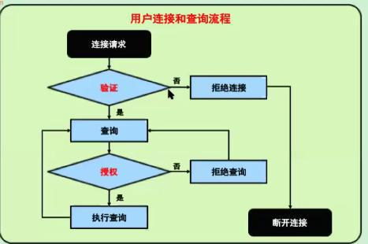

# 账户管理

在MySQL中可通过账户控制允许或不允许用户执行操作  
- 可以精细分配权限给不通职能的账户
- 避免使用root账户
	- 因公不能直接使用root
	- 防止维护期间出错
- 限制特定权限账户确保数据完整性
	- 允许特定授权账户完成期工作
	- 房主未经授权的用户访问超出其特权的数据
	

### 查询MySQL内的账户:

**`root@localhost [(none)]>select user,host ,authentication_string from mysql.user;`**

> mysql5.7引入的加密方法：`plugin: mysql_native_password`  
> mysql8.0默认的加密方法有所区别,导致升级8.0后之前程序默认无法连接，现在大多数验证使用：`mysql_native_password`

### MySQL账号的组成

MySQL账户由两部分组成：**用户名@来源**  
如:  
**root@192.168.1.100,root@172.16.1.100是属于不同的账户**  
登录连接MySQL优先使用精确匹配的原则：root@192.168.1.100和root@%，MySQL优先连接root@192.168.1.100  
***`生产实践：当线上有大量的访问查询，使用的如果是非精确匹配的账户，我们可以创建精确匹配的账户的方式进行对其怎么控制`***

用户连接和查询的流程如下图所示：  

了解MySQL的用户管理及Block用户
MySQL密码忘记如果优雅启动

理解MySQL的日志文件分类及作用
学会裁剪MySQL，让MySQL在某些发行中保持尽量的小
  